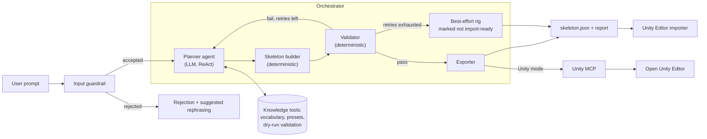

# High-Level Design: 2D Humanoid Rig Agent for Unity

**Target engine:** Unity (2D Animation package)

---

## 1. Problem Statement

Before a 2D character can be animated in Unity, someone has to rig it: build a bone hierarchy and place every joint. This is slow, repetitive work that needs rigging experience, even though most humanoid rigs share the same structure and differ mainly in proportions and a few extra bones (hair, cape, weapon).

> **Given a short text description of a humanoid character, the agent produces a valid, anatomically plausible 2D bone hierarchy for either a front-facing or a side-view (side-scroller) character, in a neutral rest pose, and delivers it to Unity.**

| | |
|---|---|
| **Input** | A text prompt, e.g. *"chibi knight with a big sword"*, and an optional view type (`front` or `side`). Without it, the agent infers the view from the prompt and defaults to front. |
| **Output** | `skeleton.json` (a schema-validated bone hierarchy with its IK chains) and a validation report. Optionally, the same skeleton is built live in an open Unity Editor, with native 2D bones and IK on the arms and legs, and saved as a prefab. |
| **In scope** | Bipedal humanoids in two view types (front-facing and side-scroller side view; details in LLD §2.5), free-form character style (presets such as realistic, heroic, stylized and chibi are starting points), optional accessory bones |
| **Out of scope** | Non-humanoids, 3/4 and top-down views, sprite or image generation, skin weights, animation (Goal 2) |

---

## 2. Architecture

### 2.1 System overview

### 2.2 Components

| Component | Responsibility |
|---|---|
| **Input guardrail** | Code checks (empty, too long, prompt injection), then a small LLM classifier. Accepts humanoid rig requests, even vague ones; rejects the rest with a reason and a suggested rephrasing. |
| **Orchestrator** | Runs the flow as a graph: at most 3 planning attempts within budgets (model calls, tokens, tool calls, time); if all fail, returns the best attempt with its report. |
| **Planner agent** | A ReAct agent: it reasons, calls tools and observes the results. It interprets the prompt and returns a rig specification: view type, a style label with a starting preset and proportions, optional and accessory bones, and the assumptions it made. |
| **Knowledge tools** | Give the planner the bone vocabulary, view rules and proportion presets, and let it test a draft specification before answering. This knowledge is only a few KB, so it lives in the prompt and tools; no RAG is needed for Goal 1. |
| **Skeleton builder** | Computes joint positions, bone lengths and parent-relative transforms from the specification, using the layout for the chosen view (mirrored limbs for front view; overlapping, depth-ordered limbs for side view). |
| **Validator** | Checks structure (one root, no cycles, required bones present) and geometry (connected joints, view-appropriate symmetry and draw order, plausible proportions); returns machine-readable errors. |
| **Exporter** | Writes the versioned `skeleton.json` (bones and IK chains) and the validation report. |
| **Unity delivery** | A C# Editor importer builds the bones from the JSON as Unity's native 2D bones, with IK on each limb that ends in a hand or foot. In Unity mode, the orchestrator installs and runs it in the open Editor through Unity MCP, verifies the result and can save a prefab. |
| **Viewer** | A local browser viewer for the rigs in `out/`, for checking a rig by eye. |
| **Observability** | Optional tracing (Logfire) of every run: tool calls, tokens, latency and validation failures. |

### 2.3 Guardrails

Guardrails work in two layers:

- **Prompt guardrails** are instructions inside the LLM prompts. They reduce how often the model breaks a rule.
- **Code guardrails** are deterministic checks around the LLM. They catch whatever the prompts miss.

The detailed rules for each area are in LLD §3.8.

---

## 3. Evaluation Criteria

**Test set:** 58 prompts, split between front and side views, covering view selection, standard characters, stylized proportions, proportion modifiers, accessories, ambiguous prompts and adversarial or out-of-scope requests. Each prompt is run 3 times per model, and results are reported per view as well as overall.

### 3.1 Quantitative metrics

**1. Does it produce a usable rig?**

- **Final validity rate (≥ 98%):** runs that end with a rig passing all validator checks.
- **First-pass schema validity (≥ 95%):** runs where the LLM's first answer already has the correct format.

**2. Is the skeleton structurally correct?**

- **Structure and required bones (100%):** one root, no loops or disconnected bones, all 14 required bones present.
- **Joint connectivity (100%):** every child bone starts where its parent ends.

**3. Does it look anatomically right?**

- **Symmetry error (≤ 1% of height):** left and right limbs mirror each other (front view) or match (side view).
- **Draw order (100%, side view):** far-side limbs are behind the body, near-side limbs in front.
- **Proportion error (≤ 10%):** body ratios match the values derived from the spec and stay inside plausible bands.

**4. Does it match the request?**

- **View accuracy (≥ 95%):** the correct view is chosen, e.g. "platformer ninja" gets a side view.
- **Style match (≥ 90%):** the proportions match the style descriptor, e.g. a "chibi mage" is 4 or fewer heads tall.
- **Accessory F1 (≥ 0.85):** requested accessory bones are added, with no unrequested extras.
- **Consistency (≥ 90%):** the same prompt gives similar proportions across repeated runs.

**5. Are the guardrails working?**

- **Guardrail recall (≥ 95%):** out-of-scope or malicious prompts are blocked.
- **False rejects (≤ 2%):** valid prompts are not blocked.
- **Prompt-rule adherence (≤ 5% violations):** first attempts rarely break prompt rules that only the code checks catch.

**6. Is it practical?**

- **Latency (p95 ≤ 30 s):** 95% of runs finish within 30 seconds.
- **Cost (≤ $0.05 per rig).**
- **Unity import success (100%):** valid rigs import with no errors and match the JSON.

### 3.2 Qualitative metrics

Rigs are scored 1–5 on four dimensions: **anatomical plausibility**, **prompt fidelity**, **animation readiness** and **rig cleanliness**.

- **Human review:** two reviewers score a sample of rigs each release. Target: average ≥ 4.0 on every dimension. An eval-only script draws each skeleton as an image for review; the agent itself never produces images.
- **Unity hands-on check:** reviewers import sample rigs and rotate limbs to confirm the joints pivot naturally.
- **Failure taxonomy:** failed cases are tagged by cause to guide improvements.

The suite can run on both providers to pick the primary model and the fallback. Currently OpenAI is primary (`gpt-5.4-mini` for the planner and the guard; the guard was chosen by eval, see [`GUARD_MODEL_COMPARISON.md`](Project/2d-bone-anim-agent/GUARD_MODEL_COMPARISON.md)) and Anthropic is the fallback. The cross-provider comparison is still to run.

---

## 4. Framework Justification

| Layer | Choice | Reasoning |
|---|---|---|
| **Agent** | **Pydantic AI** | Gives typed tools and outputs, and retries bad output automatically. |
| **Orchestration** | **LangGraph** | Controls the multi-step flow and the repair loop, and can grow to include Goal 2. |
| **Validation** | **Pydantic** | One schema checks the LLM output and produces the final JSON. |
| **Unity** | **2D Animation package, C# importer, Unity MCP** | The importer works offline; MCP builds and checks the rig in a live Editor. |
| **LLM** | **OpenAI (primary), Anthropic (fallback)** | Both handle tool calls and structured output well; the eval suite decides the primary. |
| **Observability** | **Logfire** | Traces agent calls and graph steps; off unless a token is set. |
